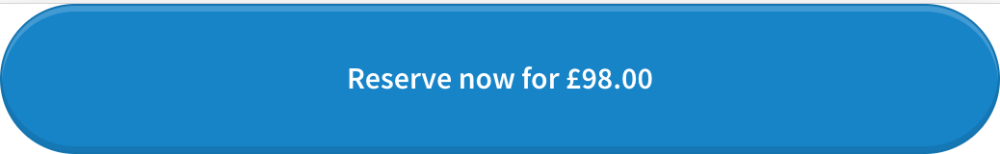
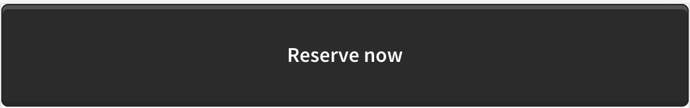

There are two options for introducing the iVendi Convert reservation tool above the fold on a full page vehicle advert.

**Recommended method - dynamic embeddable widget**

The CTA widget can be in two states - 'Reserve now' or 'Reserved'. Selecting the call to action will take the customer into the Reserve-Now reservation form.

You can choose from many different styles to find the best fit for your website. Styles contain your own theme colours and vehicle reservation price.

This widget will always fill 100% of the width of its parent element, if you want the width to be smaller, simply wrap the embed script in a smaller element. The minimum width of the widget is 300px.

**Alternate method - buttonLink**

If you want to use the reservation tool but maintain the current styles used on the website, you can retrieve the reservation link from the iVendi Convert Finance Comparator widget, once it has loaded on the page.

To do this use:

```javascript

document.getElementsByClassName('resNow__buttonLink')[0].href

```

## Getting Started

* Review the fields and values required to power the Reserve Now Call to Action
* Use our free demo to test the values
* Embed the widget using our embed code - available in HTML, PHP & WordPress and Python


## Parameters

Before you can embed the widget in to your website, you will need to know the following values:

`Denotes optional fields`

|Field Name|Format|Description|
|--- |--- |--- |
|callToActionStyle|number|A number representing the style of widget (see style examples below)|
|username|string|Your username used to access iVendi services|
|quoteeUid|string|Unique ID for the dealership which the vehicle belongs to. (If you don't have this, please contact iVendi)|
|class|car, lcv or motorbike|Class of the vehicle.|
|condition|used or new|Condition of the vehicle|
|vrm|string|Vehicle Registration Number|
|registrationDate|DD/MM/YYYY|Registration Date of the vehicle|
|capId|number|Cap Id of the vehicle|
|cashPrice|number|Cash Price|
|currentOdometerReading|number|Current Odometer Reading|
|vehicleImageUrl|string|URL for the image of the vehicle|

:::note
Where possible, please always provide either a capCode or capId to identify the vehicle. If these fields are not supplied then the VRM will be used to identify the vehicle, but only if your iVendi account supports this.
:::

### Call To Action Styles

|callToActionStyle|Preview|
|--- |--- |
|1|  |
|2||
|3||
|4||
|5||
|6||
|default||

## Demo

export const Widget = () => (
    <iframe
        src="https://newvehicle.com/widgets/lib/reserve-vehicle-cta/?callToActionStyle=4&amp;username=www.ivendimotors.com&amp;quoteeUid=268E8202-338E-4B26-A6FE-74BCDAB0A357&amp;class=car&amp;condition=used&amp;vrm=CX17HHA&amp;registrationDate=04%2F06%2F2017&amp;cashPrice=10000&amp;currentOdometerReading=10000&amp;vehicleImageUrl=https%3A%2F%2Fmedia-psa.groupe-psa.com%2Fmedias%2Fdomain1%2Fmedia11848%2F2009228-r00lv2pybs-preview.jpg&amp;origin=https%3A%2F%2Fnewvehicle.com%2Fwidgets%2Ffinance-check-cta%2Fdemo&amp;widgetId=iv-finance-check-widget"
        id="iv-finance-check-widget" name="iv-finance-check-widget" class="iv-finance-check-widget"/>
);

<Widget/>

## Code
To embed the widget on your website, simply copy the following code and paste it into the part of the page where you want the widget to appear, adding in the values for each of the fields in the url. The script is loaded asynchronously so it wont block the rest of your page from loading.


import Tabs from '@theme/Tabs';
import TabItem from '@theme/TabItem';

<Tabs
    defaultValue="HTML"
    values={[
        {label: 'HTML', value: 'HTML',},
        {label: 'PHP', value: 'php',},
        {label: 'PYTHON', value: 'python',},
    ]
    }>
<TabItem value="HTML">

```html

        <script
            src="newvehicle.com/widgets/lib/reserve-vehicle-cta/loader.js?scrollToSelector=&callToActionStyle=&username=&quoteeUid=&class=&condition=&vrm=&registrationDate=&capCode=&capId=&cashPrice=&vatIncluded=&vatQualifying=&currentOdometerReading=&vehicleImageUrl=&term=&cashDepositType=&cashDeposit=&annualDistance=&dateOnForecourt="
            async></script>

```

</TabItem>
<TabItem value="php">

```php

        <script
            src="newvehicle.com/widgets/lib/reserve-vehicle-cta/loader.js?scrollToSelector=<?=scrollToSelector?>&callToActionStyle=<?=callToActionStyle?>&username=<?=username?>&quoteeUid=<?=quoteeUid?>&class=<?=class?>&condition=<?=condition?>&vrm=<?=vrm?>&registrationDate=<?=registrationDate?>&capCode=<?=capCode?>&capId=<?=capId?>&cashPrice=<?=cashPrice?>&vatIncluded=<?=vatIncluded?>&vatQualifying=<?=vatQualifying?>&currentOdometerReading=<?=currentOdometerReading?>&vehicleImageUrl=<?=vehicleImageUrl?>&term=<?=term?>&cashDepositType=<?=cashDepositType?>&cashDeposit=<?=cashDeposit?>&annualDistance=<?=annualDistance?>&dateOnForecourt=<?=dateOnForecourt?>"
            async></script>

```

</TabItem>
<TabItem value="python">

```py

        <script
            src="newvehicle.com/widgets/lib/reserve-vehicle-cta/loader.js?scrollToSelector=<%=scrollToSelector%>&callToActionStyle=<%=callToActionStyle%>&username=<%=username%>&quoteeUid=<%=quoteeUid%>&class=<%=class%>&condition=<%=condition%>&vrm=<%=vrm%>&registrationDate=<%=registrationDate%>&capCode=<%=capCode%>&capId=<%=capId%>&cashPrice=<%=cashPrice%>&vatIncluded=<%=vatIncluded%>&vatQualifying=<%=vatQualifying%>&currentOdometerReading=<%=currentOdometerReading%>&vehicleImageUrl=<%=vehicleImageUrl%>&term=<%=term%>&cashDepositType=<%=cashDepositType%>&cashDeposit=<%=cashDeposit%>&annualDistance=<%=annualDistance%>&dateOnForecourt=<%=dateOnForecourt%>"
            async></script>

```

</TabItem>
</Tabs>

:::note
The variables used here will be different to the ones inside your template, so will need to be updated accordingly. This may cause errors on your page until the fields are correct for your site.
:::